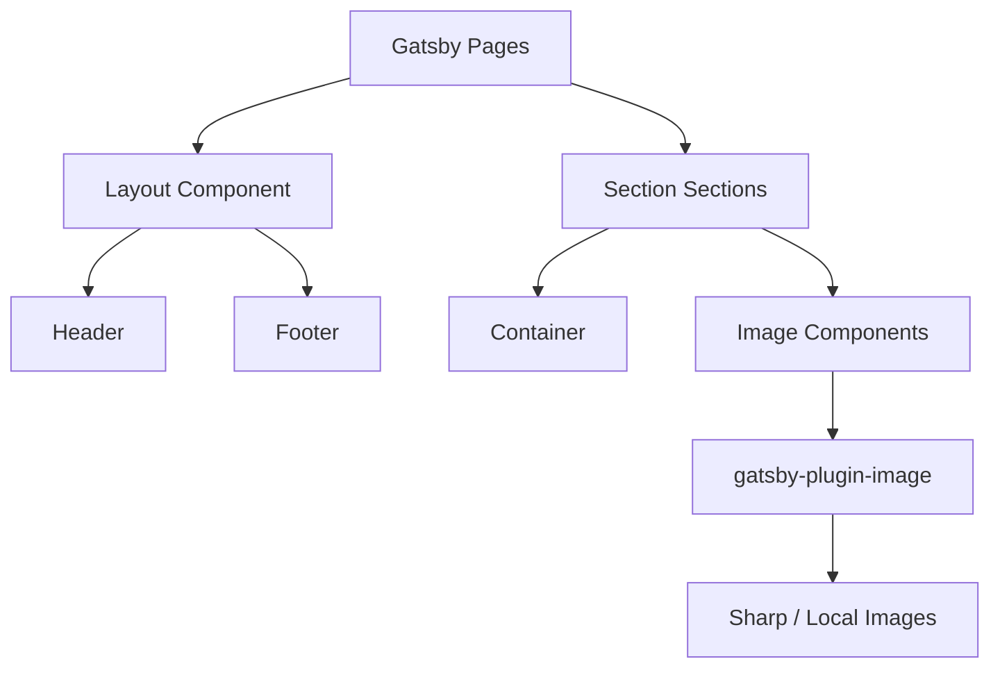

# Design Document: OpenSTR Marketing Site

## Overview

The OpenSTR marketing site is a fully static, image-first website built with Gatsby, TypeScript, and Tailwind CSS. It communicates the value of OpenSTR — an open-source, self-hosted rental property management platform — to property operators, developers, and contributors.

The design philosophy is premium coastal real estate brand, not generic SaaS. Large full-bleed imagery, strong whitespace, and elegant typography drive the experience. The product narrative is secondary to the lifestyle and operations story told through the images.

The site is deployed to Firebase Hosting as a static bundle. There is no CMS, no server runtime, no authentication, and no database.

### Key Design Decisions

- Gatsby with `gatsby-plugin-image` for responsive, optimized image delivery from local assets
- Tailwind CSS utility classes for all styling — no separate CSS files except for global base styles
- TypeScript throughout for type safety on props, page data, and image queries
- All pages are static Gatsby pages (no dynamic routing or SSR)
- Firebase Hosting serves the `public/` output directory
- Font: a serif/sans pairing appropriate for a premium real estate brand (e.g., Playfair Display for headings, Inter for body)

---

## Architecture

The site follows a standard Gatsby static site architecture:

```
src/
  components/       # Shared UI components
  images/           # Source images (copied from /source)
  pages/            # Gatsby page components (one file = one route)
  styles/           # Global CSS (Tailwind base import only)
gatsby-config.ts    # Plugin configuration
tailwind.config.js  # Tailwind theme extension
tsconfig.json       # TypeScript config
firebase.json       # Firebase Hosting config
.firebaserc         # Firebase project config
```

### Build Pipeline

```
gatsby build  →  public/  →  firebase deploy
```

Gatsby processes all pages, runs GraphQL queries for image data, optimizes images via Sharp, and outputs a fully static bundle to `public/`.

### Dependency Graph



---

## Components and Interfaces

### Shared Components

#### Layout

Wraps every page. Renders `<Header>`, `{children}`, and `<Footer>`. Accepts SEO props passed down to a `<Seo>` component.

```typescript
interface LayoutProps {
  children: React.ReactNode;
  title: string;
  description?: string;
  ogImage?: string;
}
```

#### Seo

Renders `<title>`, `<meta name="description">`, and Open Graph tags into the document `<head>` via Gatsby Head API.

```typescript
interface SeoProps {
  title: string;
  description: string;
  ogImage?: string;
  pathname?: string;
}
```

#### Header

Renders the OpenSTR wordmark, navigation links, and GitHub CTA. Includes a mobile hamburger menu with toggle state.

```typescript
interface HeaderProps {
  // no external props — nav links are static
}
```

Navigation links (static):
- Home `/`
- About `/about`
- Why OpenSTR `/why-openstr`
- Contribute `/contribute`
- FAQ `/faq`
- GitHub (external, `https://github.com/openstr`)

#### Footer

Renders navigation links and a brief project description.

#### Section

Provides consistent vertical padding between content blocks.

```typescript
interface SectionProps {
  children: React.ReactNode;
  className?: string;
  id?: string;
}
```

#### Container

Constrains content to a max-width with consistent horizontal padding.

```typescript
interface ContainerProps {
  children: React.ReactNode;
  className?: string;
  narrow?: boolean; // narrower max-width for text-heavy sections
}
```

#### Button

Supports primary and secondary variants. Renders as `<a>` when `href` is provided, `<button>` otherwise.

```typescript
interface ButtonProps {
  variant: 'primary' | 'secondary';
  href?: string;
  onClick?: () => void;
  children: React.ReactNode;
  external?: boolean; // adds target="_blank" rel="noopener noreferrer"
  className?: string;
}
```

### Page-Level Section Components

Each homepage section is a standalone component:

| Component | Requirement | Images Used |
|---|---|---|
| `Hero` | Req 3 | `Outside.png` or `sunrise.png` |
| `ProblemSolution` | Req 4 | — |
| `ValueProps` | Req 5 | — |
| `PropertyShowcase` | Req 6 | `Insidepool.png`, `Daytime.png`, `Outside.png`, `sunrise.png` |
| `CleaningWorkflow` | Req 7 | `Cleaningb4.png`, `cleaningafter.png` |
| `GuestOutcome` | Req 8 | `happyguests.png` |
| `WhyOpenstrTeaser` | Req 9 | — |
| `ContributorCta` | Req 10 | — |

### Image Mapping

A centralized `src/images/index.ts` exports all image imports so components reference a single source of truth:

```typescript
// src/images/index.ts
export { default as imgOutside } from './Outside.png';
export { default as imgSunrise } from './sunrise.png';
export { default as imgDaytime } from './Daytime.png';
export { default as imgInsidepool } from './Insidepool.png';
export { default as imgHappyguests } from './happyguests.png';
export { default as imgCleaningBefore } from './Cleaningb4.png';
export { default as imgCleaningAfter } from './cleaningafter.png';
```

With `gatsby-plugin-image`, images are queried via GraphQL `useStaticQuery` or imported directly as `StaticImage` components.

---

## Data Models

The site is fully static with no runtime data. The only "data" is:

### Navigation Links

```typescript
interface NavLink {
  label: string;
  path: string;
  external?: boolean;
}

const NAV_LINKS: NavLink[] = [
  { label: 'Home', path: '/' },
  { label: 'About', path: '/about' },
  { label: 'Why OpenSTR', path: '/why-openstr' },
  { label: 'Contribute', path: '/contribute' },
  { label: 'FAQ', path: '/faq' },
  { label: 'GitHub', path: 'https://github.com/openstr', external: true },
];
```

### Value Proposition Cards

```typescript
interface ValueProp {
  title: string;
  description: string;
}

const VALUE_PROPS: ValueProp[] = [
  { title: 'Hosted by you', description: 'Run OpenSTR on your own infrastructure. Your data stays yours.' },
  { title: 'Free and open source', description: 'No licensing fees. No vendor agreements. Fork it, own it.' },
  { title: 'Custom workflows', description: 'Build the operations process that fits your properties, not a template.' },
  { title: 'Built for operators', description: 'Designed around how real property managers actually work.' },
  { title: 'Short + long-term rentals', description: 'Manage STR and LTR properties from a single platform.' },
  { title: 'Contributor-friendly', description: 'Clear contribution paths for developers, operators, and writers.' },
];
```

### FAQ Items

```typescript
interface FaqItem {
  question: string;
  answer: string;
}
```

### Contributor Pathways

```typescript
interface ContributorPath {
  label: string;
  description: string;
  href: string;
}
```

### Page Metadata

```typescript
interface PageMeta {
  title: string;
  description: string;
  ogImage?: string;
}

const PAGE_META: Record<string, PageMeta> = {
  '/': { title: 'OpenSTR — Rental Property Management You Control', description: '...' },
  '/about': { title: 'About OpenSTR', description: '...' },
  '/why-openstr': { title: 'Why OpenSTR', description: '...' },
  '/contribute': { title: 'Contribute to OpenSTR', description: '...' },
  '/faq': { title: 'FAQ — OpenSTR', description: '...' },
};
```

---

## Correctness Properties

*A property is a characteristic or behavior that should hold true across all valid executions of a system — essentially, a formal statement about what the system should do. Properties serve as the bridge between human-readable specifications and machine-verifiable correctness guarantees.*


### Property 1: Layout always renders header and footer

*For any* content passed as children to the Layout component, the rendered output SHALL contain both a header element and a footer element wrapping the children.

**Validates: Requirements 1.3**

### Property 2: Button variants produce distinct rendering

*For any* button label string, rendering the Button component with `variant='primary'` and rendering it with `variant='secondary'` SHALL both succeed and produce outputs with different CSS class attributes.

**Validates: Requirements 1.6**

### Property 3: All images have non-empty alt text

*For any* image component rendered on the site, the resulting `` element SHALL have a non-empty `alt` attribute.

**Validates: Requirements 2.3, 17.3**

### Property 4: All six value proposition cards are rendered

*For any* rendering of the ValueProps component, the output SHALL contain all six card titles: "Hosted by you", "Free and open source", "Custom workflows", "Built for operators", "Short + long-term rentals", and "Contributor-friendly".

**Validates: Requirements 5.1**

### Property 5: All four showcase images are rendered

*For any* rendering of the PropertyShowcase component, the output SHALL reference all four images: Insidepool, Daytime, Outside, and sunrise.

**Validates: Requirements 6.1**

### Property 6: Why OpenSTR section covers all ownership arguments

*For any* rendering of the WhyOpenstrTeaser component, the output SHALL contain content covering all four ownership arguments: control, no lock-in, flexible workflows, and open source.

**Validates: Requirements 9.1**

### Property 7: All contributor pathways are present and link to GitHub

*For any* rendering of the ContributorCta component or the Contribute page, all contribution pathway links SHALL be present and every link href SHALL begin with `https://github.com`.

**Validates: Requirements 10.1, 10.2, 13.3**

### Property 8: FAQ page contains all required questions

*For any* rendering of the FAQ page, the output SHALL contain all five required question strings: "What is OpenSTR?", "Is it only for Airbnb?", "Does it support long-term rentals?", "Is it free?", and "Can I self-host it?".

**Validates: Requirements 14.1**

### Property 9: Header contains all navigation links

*For any* rendering of the Header component, the output SHALL contain navigation links to all five routes: `/`, `/about`, `/why-openstr`, `/contribute`, `/faq`, plus a link to the GitHub repository.

**Validates: Requirements 15.2, 15.3**

### Property 10: Mobile menu toggle changes navigation visibility

*For any* Header render, toggling the mobile menu control SHALL change the visibility or display state of the navigation link list.

**Validates: Requirements 15.5**

### Property 11: Every page has complete SEO metadata

*For any* page component rendered through the Layout/Seo component, the document head SHALL contain a `<title>` element, a `<meta name="description">` tag, and Open Graph tags for `og:title`, `og:description`, and `og:image`.

**Validates: Requirements 17.1, 17.2**

---

## Error Handling

Since this is a fully static site with no runtime, error handling is minimal:

### Build-Time Errors
- Missing image files will cause `gatsby build` to fail with a clear error from Sharp/gatsby-plugin-image. All images must be present in `src/images/` before building.
- TypeScript type errors will fail the build. All component props must be correctly typed.
- Missing Gatsby page files will result in 404s — all five page files must exist.

### Runtime (Client-Side) Errors
- Broken internal links: Gatsby's `<Link>` component handles internal routing. All `href` values for internal links must match defined page routes.
- External links (GitHub): These are static strings. No runtime validation is possible; they must be verified during QA (Requirement 20.5).
- Image load failures: If a deployed image fails to load, the `alt` text provides fallback content. All images must have descriptive alt text (Requirement 2.3).

### 404 Handling
- Firebase Hosting should be configured to serve a Gatsby-generated 404 page. The `firebase.json` should not include a catch-all redirect that would mask missing pages.

### Mobile Menu State
- The Header's mobile menu uses local React state (`useState`). If JavaScript is disabled, the menu will not toggle. The nav links should still be accessible via CSS fallback or the menu should default to visible on no-JS environments.

---

## Testing Strategy

This site is a static marketing site with no backend logic, no data transformations, and no algorithms. The primary testable behaviors are component rendering correctness, content completeness, and link validity.

### PBT Applicability Assessment

Property-based testing is applicable in a limited but meaningful way for this site. The components are pure rendering functions — given props, they produce HTML output. Several correctness properties (listed above) are universal: they must hold for any valid input, not just specific examples. PBT is appropriate for:
- Component rendering properties (Layout, Button, Header, ValueProps, ContributorCta, FAQ)
- Content completeness properties (all cards, all nav links, all FAQ questions)
- Link validity properties (all GitHub links)

PBT is NOT appropriate for:
- Visual/responsive design requirements (manual QA)
- Configuration/file existence checks (smoke tests)
- SEO tag injection (Gatsby Head API — requires integration test)

### Unit Tests (Example-Based)

Test specific component rendering with concrete examples:
- Hero renders correct headline text and CTA links
- CleaningWorkflow renders Before/After images with correct alt text
- GuestOutcome renders the exact message string
- About, WhyOpenstr, Contribute pages render expected content sections
- Footer renders nav links and description
- Semantic HTML elements present in page renders

### Property-Based Tests

Use a PBT library appropriate for TypeScript/React (e.g., `fast-check`) with minimum 100 iterations per property.

Each property test is tagged with:
`// Feature: openstr-marketing-site, Property {N}: {property_text}`

| Property | Test Description |
|---|---|
| Property 1 | Layout wraps any children with header + footer |
| Property 2 | Button primary/secondary variants always differ in class output |
| Property 3 | Any image component produces non-empty alt text |
| Property 4 | ValueProps always renders all 6 card titles |
| Property 5 | PropertyShowcase always references all 4 images |
| Property 6 | WhyOpenstrTeaser always covers all 4 ownership arguments |
| Property 7 | ContributorCta/Contribute page links always point to GitHub |
| Property 8 | FAQ page always contains all 5 questions |
| Property 9 | Header always contains all nav links |
| Property 10 | Mobile menu toggle always changes nav visibility |
| Property 11 | Every page always produces complete SEO metadata |

### Smoke Tests

Manual or single-execution checks before launch:
- `tsconfig.json` and Tailwind config exist and are valid
- All 5 page files exist at correct paths
- All 7 image files exist in `src/images/`
- `gatsby-plugin-image` is in `gatsby-config.ts`
- `firebase.json` and `.firebaserc` exist with correct config
- `gatsby build` completes without errors
- All internal navigation links resolve correctly
- No placeholder text ("Lorem ipsum", "TODO") in any page
- All GitHub CTA links point to correct OpenSTR repository URLs
- Mobile layout QA on 375px and 768px viewports
- Visual design review: premium feel, no broken layouts

### Integration Tests

- Full `gatsby build` output verification: all 5 routes produce HTML files in `public/`
- Firebase deploy dry-run: `firebase deploy --only hosting --dry-run` succeeds
